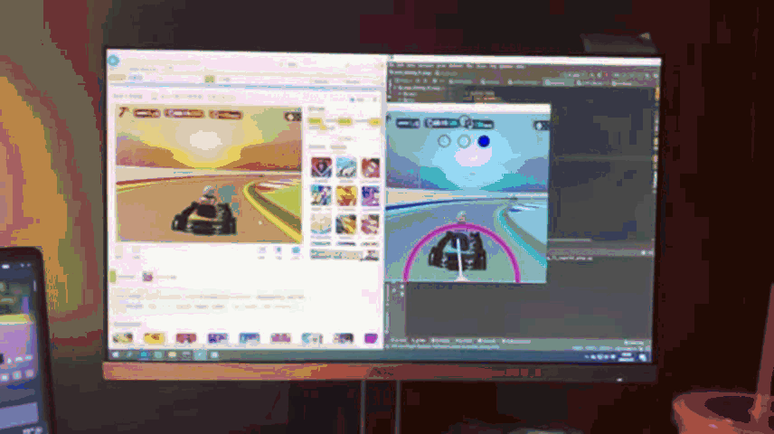

# 使用深度学习实现游戏简单自动驾驶
Auto driving Formula 1 2019 Game / Go Kart with Deep Learning
## 环境要求
* anaconda3
* pytorch: 1.2.0 (应该>1.0.0都可以)
* python: 3.6/3.7
* tensorboard/tensorflow/tensorboardX: 1.14.0   1.14.0   2.0
* easyDict: 1.9
* opencv-python: 3.4.2.16
------
  以下是在windows上玩需要具备的包，主要是对于win32的操作，如按键获取，虚拟按键等
> * pywin32: 227
> * pypiwin32: 223

## 硬件配置
  在PC windows上的硬件配置如下，游戏实时帧率约为20fps（使用cuda），获取保存帧率可以达到70-100帧，但有帧率限幅，限制在10帧左右
* 显卡：Nvidia RTX 2080 Super
* CPU：AMD 锐龙 3600X
  训练时间非常快，大约20-30min可以训练10k次迭代
  
## 根目录结构
* 根目写在config文件中的 ROOT_PATH 变量中，根据不同情况做调整，以下是根目录结构
- data (根目录)  
-- image (存放所有jpeg格式图片)  
-- npy (里面就一个文件，存放着control信息的numpy数组)  

### 数据格式要求
* 图片是以JPEG格式存放的，以0-xxx编号
* 控制数组标准格式下包括5个量，分别是 【左 右 上 下 速度】
* 速度是以 F1 的真实速度保存的，并没有进行归一化，最大值约在320左右。在训练时才进行归一化
* F1图像是缩小到150 * 150大小，Go Kart图像是 200 * 200 大小，都是灰度图像
* 在输入网络前都要将其变换只227 * 227 大小，这个工作会在重写的 DataSet 类中完成

## 使用方法（当前只支持GO Kart游戏）
1. 在windows PC上，使用左右双应用显示，将游戏页面调整到最顶端；
2. 游戏网页在左，PyCharm在右。使用Internet Explorer打开
3. 直接打开AI_play文件，在config的 MODEL_DIR_PATH 属性中更改至当前的模型路径（一般不用更改）
4. 直接run AI_play这个文件即可

游戏连接：[3D卡丁车竞速](http://www.4399.com/flash/122786_1.htm)   原网址:http://www.4399.com/flash/122786_1.htm

## 训练网络
1. 在config中首先配置好 DATA_ROOT_PATH 和 DATA_ROOT_PATH_VAL 的根目录
2. 同样在config文件里配置相应的 learning rate，batch_size, 是否使用CUDA等信息
3. 打开collect_kart文件，运行即可。
！！！运行时必须要右验证集，否则就在程序中注释掉验证的对应程度段

## 神经网络
  使用的是微调的AlexNet，由于输入的是灰度图像对网络结构做了相应的降维处理，更改如下：
  * 修改输入为一维图像而不是三维 (channel from 3 to 1)
  * 在conv5层的最后多加了一个Max Pooling层，将最终的网络输出从 (6x6x256) 降至 (2x2x256)
  * 调整全连接层，从 (9016-4096-4096-1000) 改为了 (1024-512-512-1/3)，对于速度预测是1，方向预测最后一个维度是3

## 可视化训练进程
  使用tensorboardX进行可视化，但前提需要安装所有tensorflow组件包，否则不能使用tensorboard查看（但程序不会报错）
  * 输出位置为：./output/run/dir or speed 
  * 查看时首先在项目的根目录下打开cmd窗口或prompt
  * 输入： tensorboard --logdir=./output/run/speed or dir --port=6000

## 实际测试
  由于卡丁车游戏的视角高（车尾视角）且道路简单，神经网络网络在卡丁车游戏中表现得非常好，暂时还未实现在F1 2019游戏的自动驾驶。
  * 驾驶片段:     
  
  * 驾驶视频请在这里下载观看(videp.mp4 文件)      
  [video](./docs/)
